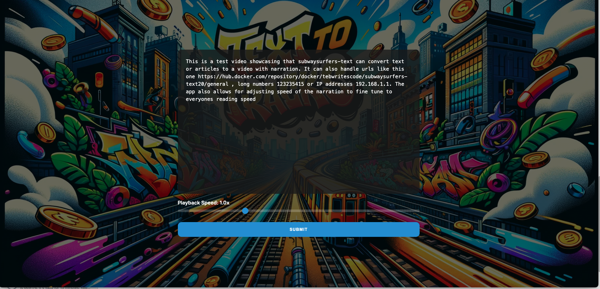

The information that follows is inspired by the original project found at [danielbonkowsky/subwaysurfers-text](https://github.com/danielbonkowsky/subwaysurfers-text). If you find this guide helpful, please extend your appreciation to the original creator, Daniel Bonkowsky.

# Text to Tracks: A Subway Surfers Video Article Converter

## Inspiration
Remaining focused and attentive when reading educational materials can often be difficult. Recognizing this challenge, we set out to create a solution that makes learning more captivating and enjoyable.

## What It Does
Our web application transforms article links by extracting the text and presenting it in a Subway Surfers-style video format akin to TikTok. This engaging format allows users to absorb information more effectively by capturing their attention.

## How We Built It
The application was constructed using a combination of Python, HTML/CSS, Flask, OpenCV, goose3, Vosk API, among other Python libraries.

## Supported Platforms
The project was tested on macOS and the local server is compatible with Safari, Chrome, and Firefox browsers.

## Demo

[Watch the demo video](./demo/demo_output.mp4)

## Installation

1. Ensure [Python](https://www.python.org/) (version 3.11 or higher) is installed on your system.

2. Clone the repository using the following command:
   ```
   git clone https://github.com/tebwritescode/subwaysurfers-text-multi.git
   ```

3. Set up a Python environment using version 3.12.

4. Install the required `pip3` dependencies:
   ```
   pip3 install -r requirements-pip.txt
   ```

5. Install necessary dependencies via Homebrew:
   ```
   xargs brew install < requirements-brew.txt
   ```

6. Download the Subway Surfers [background gameplay](https://drive.google.com/file/d/1ZyFZKIB1HiZM_XDQPRRiiAIvU4sgl10k/view?usp=drive_link), rename it to `surf.mp4`, and place it into the `static` folder of your local repository. Additional videos can be added to the `./static` folder, and one will be randomly selected for each run.

7. Obtain the [Vosk English Model](https://alphacephei.com/vosk/models/vosk-model-en-us-0.22.zip), unzip it, and place the folder into the `static` directory of your local repository.

## Running with Docker
https://hub.docker.com/r/tebwritescode/subwaysurfers-text20

## Running on baremetal

1. Open your terminal and navigate to the repository.

2. Start the development server with:
   ```
   flask run
   ```

or

2. Start the development server opening all interfaces and selecting a custom port(HERE BE DRAGONS, know the danger) replace 3000 with your port of choice
   ```
   flask run -h 0.0.0.0 -p 3000
   ```

3. In your browser, access the local server.

4. Paste the article link you wish to convert into the text box and click `Submit`. While video generation may take some time, the terminal will indicate the program is functioning. If prompted to override any files, proceed to override them.


## Planned Future Features
 - Environment variables to adjust speed
 - Environment variables to select voice
 - NVIDIA GPU Support(Works in the manual install version)
 - Figure out why sometimes the subtitles get stuck
